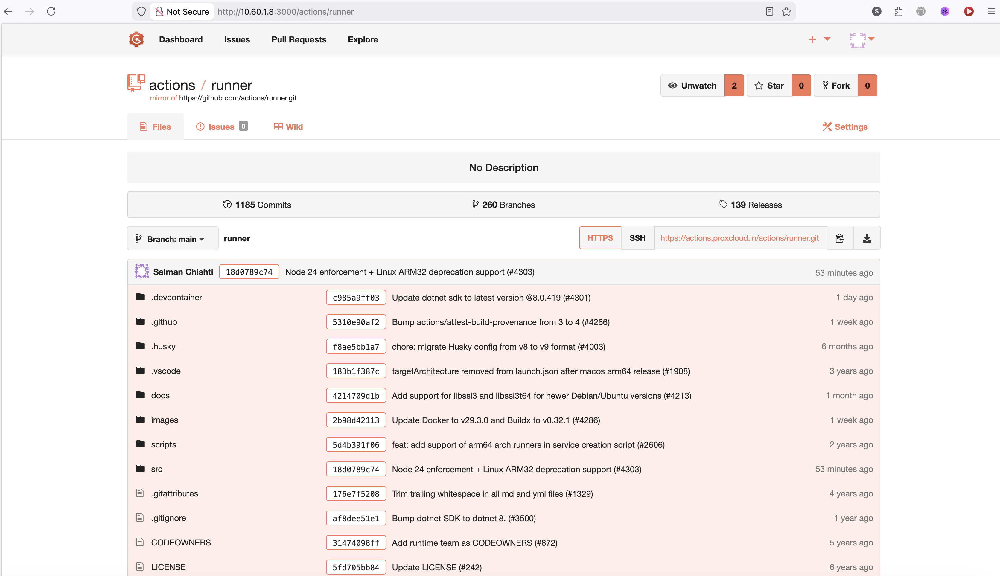
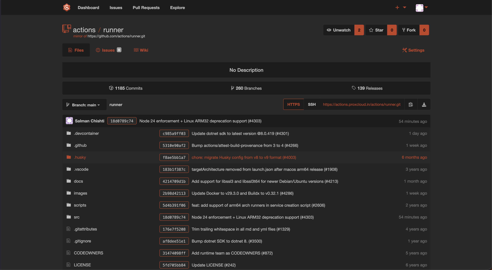

# 🎨 Custom Themed Gogs (Docker)

This project provides a simple way to run **Gogs** with a **custom theme system** using Docker.
It dynamically applies a selected theme at container startup using an entrypoint script.

---

## 🚀 Features

* 🔄 Dynamic theme selection via environment variable (`THEME`)
* 🎨 Custom CSS injection into Gogs UI
* 📦 Lightweight extension of the official `gogs/gogs` image
* 🛠 Automatic fallback to default theme
* 🔐 Proper permissions handling

---

## 📁 Project Structure

```
.
├── Dockerfile
├── entrypoint.sh
└── themes/
    ├── default/
    │   └── custom_theme.css
    ├── dark/
    │   └── custom_theme.css
    └── <your-theme>/
        └── custom_theme.css
```

---

## 🐳 Dockerfile

```dockerfile
FROM gogs/gogs:latest

USER root

# Copy theme folder
COPY /themes ./themes

# Copy entrypoint
COPY entrypoint.sh /entrypoint.sh
RUN chmod +x /entrypoint.sh

ENTRYPOINT ["/entrypoint.sh"]
```

---

## ⚙️ How It Works

At container startup:

1. Reads the `THEME` environment variable (defaults to `default`)
2. Validates the theme exists
3. Clears existing injected styles
4. Copies the selected theme CSS
5. Injects it into Gogs `<head>`
6. Fixes permissions
7. Starts Gogs normally

---

## 🔧 Environment Variables

| Variable | Default   | Description           |
| -------- | --------- | --------------------- |
| `THEME`  | `default` | Theme folder to apply |

---

## ▶️ Usage

### Build Image

```bash
docker build -t gogs-custom-theme .
```

### Run Container

```bash
docker run -d \
  -p 3000:3000 \
  -p 2222:22 \
  -e THEME=dark \
  -v gogs-data:/data \
  gogs-custom-theme
```

---

## 🎨 Creating a Theme

1. Create a new folder inside `themes/`
2. Add your CSS file:

```
themes/my-theme/custom_theme.css
```

3. Run container with:

```bash
-e THEME=my-theme
```

---

## 📜 Entrypoint Script Behavior

* Clears old styles:

  ```
  /data/gogs/public/css/*
  /data/gogs/templates/inject/*
  ```

* Injects:

  ```html
  <link rel="stylesheet" href="/css/custom_theme.css">
  ```

* Copies theme CSS to:

  ```
  /data/gogs/public/css/custom_theme.css
  ```

---

## ⚠️ Fallback Logic

* If selected theme is missing → falls back to `default`
* If `default` is missing → container logs error and exits

---

## 🔒 Permissions

Ensures correct ownership:

```bash
chown -R git:git /data
```

---

## 🧪 Logs Example

```
[INIT] Applying GogsThemes (dark)...
[INIT] Theme 'dark' applied!
```

---

## 💡 Notes

* Themes are **pure CSS overrides**
* No modification of Gogs core files required
* Safe for upgrades

---

## 📸 Screenshots

### Default Theme





